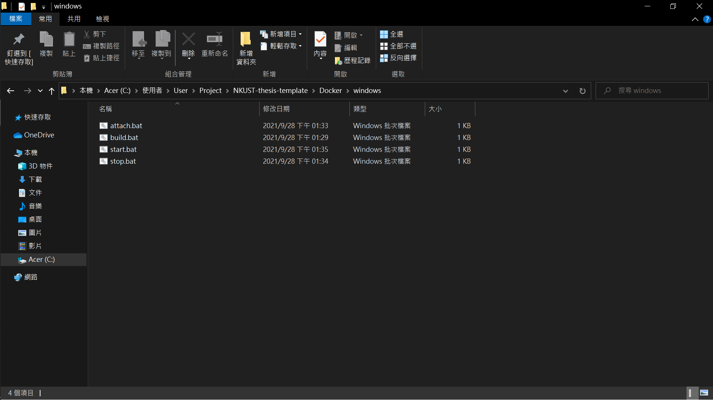
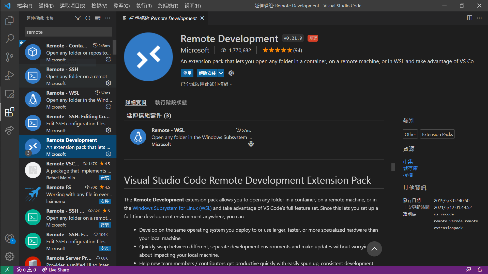
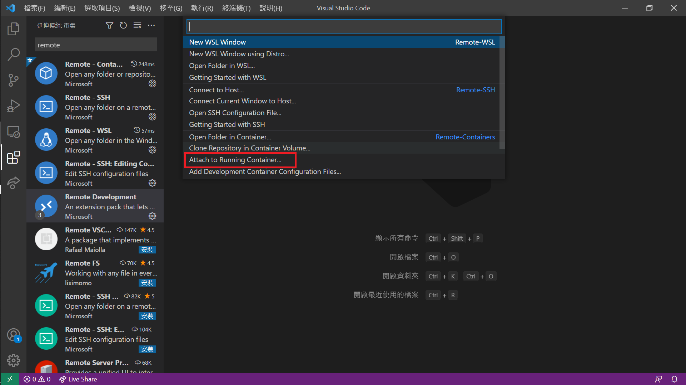
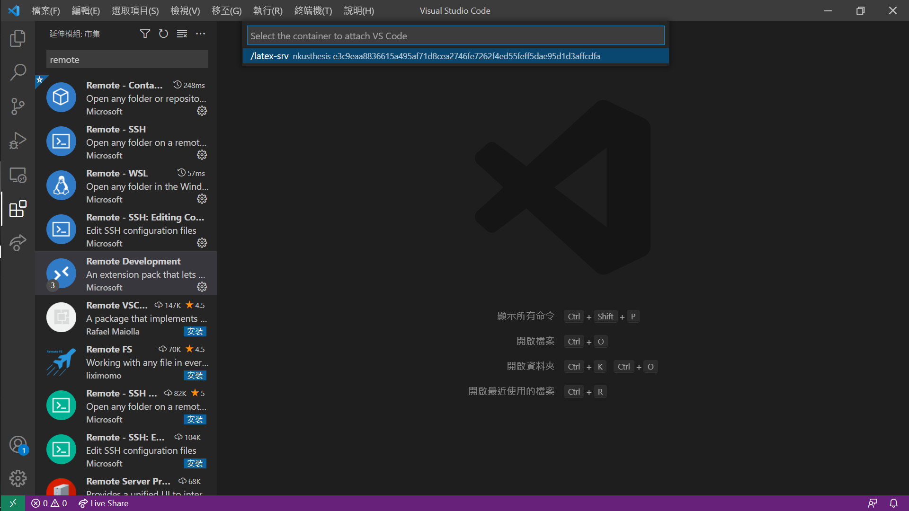
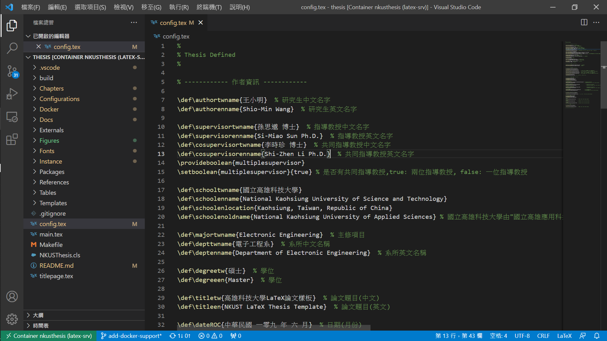

# Docker

[繁體中文](docker.md) | **English**

This page describes how to deploy the thesis build environment quickly with Docker.

## How it works

The thesis files live on the host system. At startup, the NKUST-thesis-template directory on the host is mounted into the container. You can edit and compile remotely with an editor, for example through the VSCode Remote Development extension.

When the container shuts down, everything inside it except the thesis directory is erased.

## Deployment

This template can be compiled inside a Docker container. Install Docker first, then set up the environment for your operating system.

### Installing Docker
* [Windows install](https://docs.docker.com/desktop/windows/install/)
* [Mac OS install](https://docs.docker.com/desktop/mac/install/)
* [Ubuntu install](https://docs.docker.com/engine/install/ubuntu/)

### CLI environment

> For Linux / Mac

* Build the Docker image. The script customizes the user environment; the image is based on [texlive](https://hub.docker.com/r/texlive/texlive).
```
$ ./Docker/linux/build
```
* Start latex-srv. The script runs the container in the background.
```
$ ./Docker/linux/start
```
To enter the container's bash, attach to it. To leave, press `ctrl+p` then `ctrl+q`; typing `exit` shuts the container down.
```
$ ./Docker/linux/attach
```
* Stop latex-srv, shutting down the background container.
```
$ ./Docker/linux/stop
```

### cmd / PowerShell environment

> For Windows 10

The scripts described in this section live in `Docker/windows`.


* Build the Docker image. The script customizes the user environment; the image is based on [texlive](https://hub.docker.com/r/texlive/texlive). Double-click build.bat or run it from cmd / PowerShell.
```
> ./Docker/windows/build.bat
```
* Start latex-srv. The script runs the container in the background. Double-click start.bat or run it from cmd / PowerShell.
```
> ./Docker/windows/start.bat
```
To enter the container's bash, attach to it. To leave, press `ctrl+p` then `ctrl+q`; typing `exit` shuts the container down. Double-click attach.bat or run it from cmd / PowerShell.
```
> ./Docker/windows/attach.bat
```
* Stop latex-srv, shutting down the background container. Double-click stop.bat or run it from cmd / PowerShell.
```
> ./Docker/windows/stop.bat
```

## Writing the thesis with VSCode

Connect through the VSCode Remote Development extension. All tools in the Docker directory are supported.

1. Build the image: double-click the script or run the build command from the project directory in a terminal. Install Docker before this step. If the image already contains a user with the same name as yours, edit the build script to set USER / USERID. Note that changing the user information means files can have permission problems when you work outside the Docker environment.
    * Linux / Mac
    ```
    $ ./Docker/linux/build
    ```
    * Windows
    ```
    > ./Docker/windows/build.bat
    ```
2. Install the Remote Development extension.

3. Start the container: double-click the script or run the start command from the project directory in a terminal. If everything works, the terminal closes by itself after the script runs.
    * Linux / Mac
    ```
    $ ./Docker/linux/start
    ```
    * Windows
    ```
    > ./Docker/windows/start.bat
    ```
4. Press `ctrl+p` to open the command palette, find (or type) `> Remote-Container: Attach to Running container ...`, then select *latex-srv* to enter the development environment.


5. Open the folder. The thesis directory is mounted at `/home/<username>/thesis` by default.

