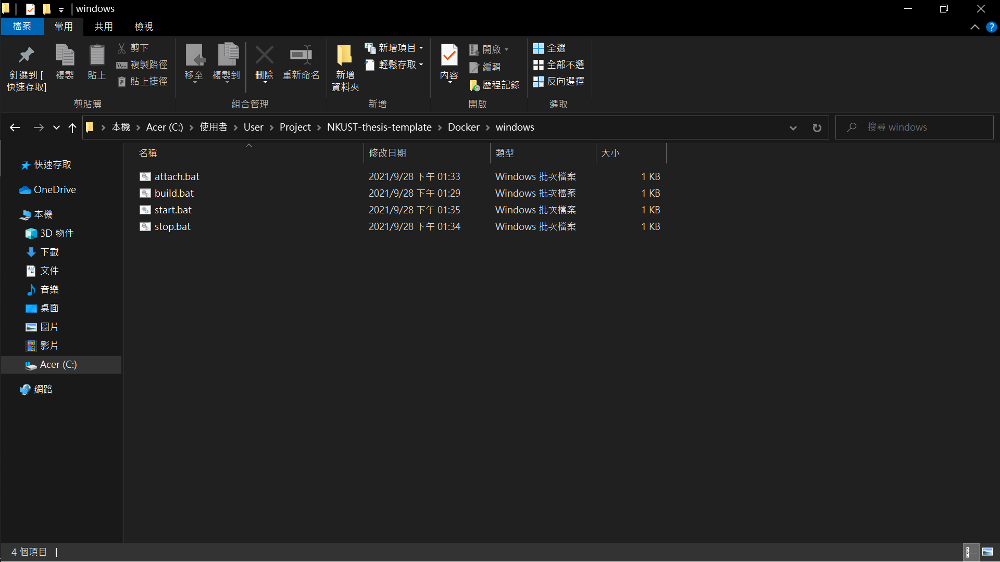
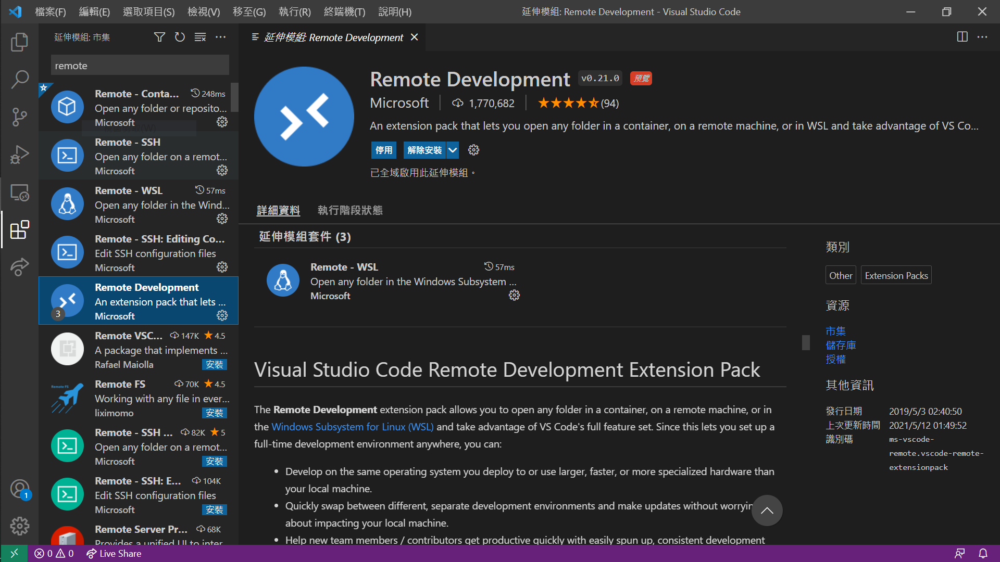
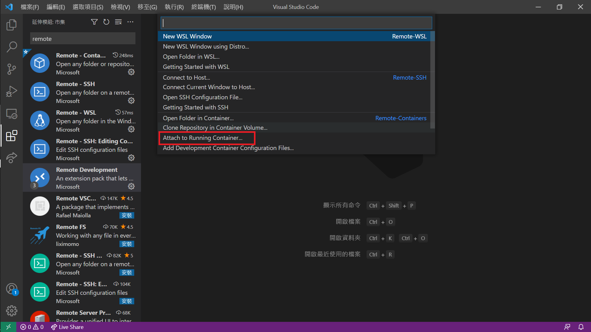
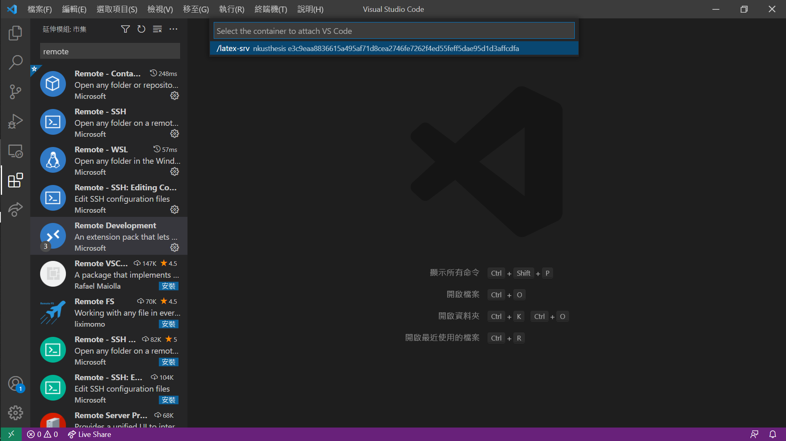
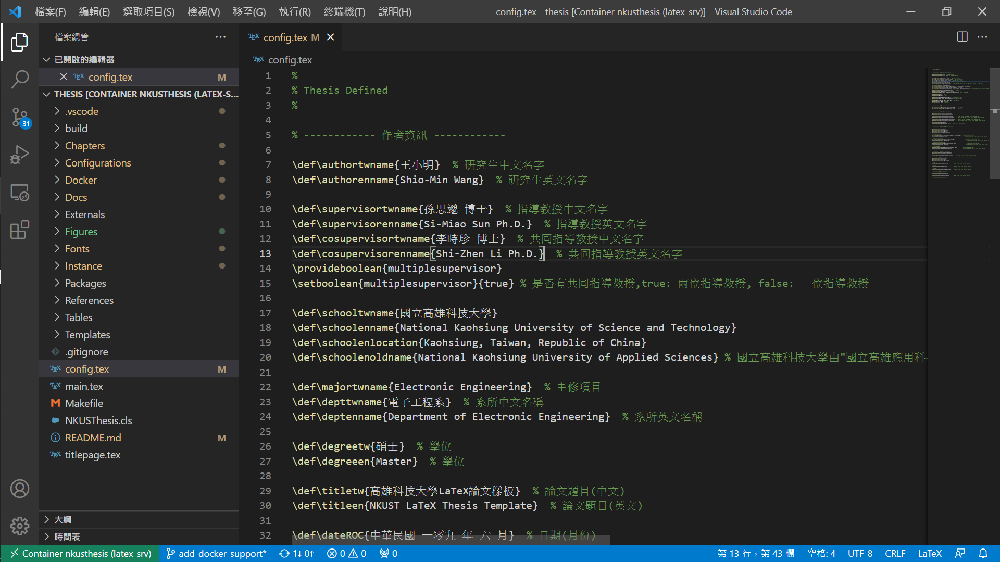

# Docker

這個章節紀錄使用 docker 快速佈署論文編譯環境的操作流程。

## 運作架構

論文主體存在於 host 系統中，開機時會自動把 host 中的 NKUST-thesis-template 掛載到 Container 上。可利用 vscode remote development extension 等編輯器進行遠端編輯與編譯。

當 container 被關閉時，除論文目錄以外的 container 的資料都會被抹除。如要有須保留 container 資料請在 `docker run` 的啟動參數中移除 `--rm` 即可。

## 環境佈署

此版型可透過 docker container 環境進行編譯，請先安裝 docker 後在依電腦作業系統平台進行環境建立。

### 安裝 docker
* [Windows install](https://docs.docker.com/desktop/windows/install/)
* [Mac OS install](https://docs.docker.com/desktop/mac/install/)
* [Ubuntu install](https://docs.docker.com/engine/install/ubuntu/)

### CLI 環境

> 適用於 Linux / Mac

* 編譯 docker image，客制化使用者開發環境參數，基底源自 [texlive](https://hub.docker.com/r/texlive/texlive)。
```
$ ./Docker/linux/build
```
* 啟動 latex-srv，使用腳本會運作於背景中。
```
$ ./Docker/linux/start
```
如須進入到環境的 bash 中，可以透過 attach 進入環境。如果要離開環境請用 `ctrl+p` + `ctrl+q`，如使用 `exit` 將會關閉該 container。
```
$ ./Docker/linux/attach
```
* 關閉 latex-srv，關閉運作於背景的 container。
```
$ ./Docker/linux/stop
```

### cmd / PowerShell 環境

> 適用於 Windows 10

本節說明的檔案位於專案中的 `Docker/windows` 中。


* 編譯 docker image，客制化使用者開發環境參數，基底源自 [texlive](https://hub.docker.com/r/texlive/texlive)，可使用滑鼠雙擊 build.bat 或使用 cmd / powershell 執行。
```
> ./Docker/windows/build.bat
```
* 啟動 latex-srv，使用腳本會運作於背景中，可使用滑鼠雙擊 build.bat 或使用 cmd / powershell 執行。
```
> ./Docker/windows/start.bat
```
如須進入到環境的 bash 中，可以透過 attach 進入環境。如果要離開環境請用 `ctrl+p` + `ctrl+q`，如使用 `exit` 將會關閉該 container，可使用滑鼠雙擊 build.bat 或使用 cmd / powershell 執行。
```
> ./Docker/windows/attach.bat
```
* 關閉 latex-srv，關閉運作於背景的 container，可使用滑鼠雙擊 build.bat 或使用 cmd / powershell 執行。
```
> ./Docker/windows/stop.bat
```

## 使用 vscode 進行論文撰寫

透過 vscode remote extension 進行連線操作，支援 Docker 目錄中所有工具。

1. 編譯 image，可雙擊檔案或以 terminal 於專案目錄中執行編譯指令，在此之前請安裝完 docker。如果發生 Image 中已有與您相同名稱使用者，請直接修改 build 來指定 USER / USERID 等資訊。務必注意，修改使用者資訊意味著您在非 docker 的環境中時，檔案會有操作權限的問題。
    * Linux / Mac
    ```
    $ ./Docker/linux/build
    ```
    * Windows
    ```
    > ./Docker/windows/build.bat
    ```
2. 安裝 remote extension

3. 啟動 container 進行服務可雙擊檔案或以 terminal 於專案目錄中執行啟動指令。如果正常運作執行後終端機將會自動關閉。
    * Linux / Mac
    ```
    $ ./Docker/linux/start
    ```
    * Windows
    ```
    > ./Docker/windows/start.bat
    ```
4. `ctrl+p` 呼叫命令工具，找到(可直接輸入) `> Remote-Container: Attach to Running container ...`，點擊後選擇 *latex-srv* 即可進入開發環境。


5. 開啟資料夾，論文目錄預設掛載在 `/home/<使用者名稱>/thesis` 中。



